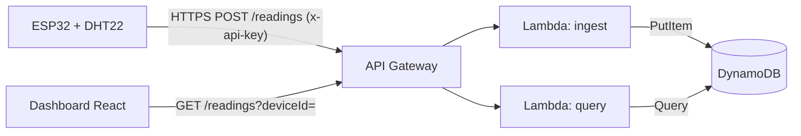

# Monitoreo IoT: dashboard con sensores ESP32 simulados

Dashboard en tiempo real (React + Vite + Recharts) que muestra temperatura, humedad y estado de 4 nodos ESP32 de una operación agrícola. Incluye gráficas en vivo, umbrales editables por dispositivo, alertas, detección de nodos sin señal y modo oscuro.

**Demo:** _pega aquí tu link de Vercel/Netlify_

## Ejecutar

```bash
npm install
npm run dev      # desarrollo
npm run build    # produce /dist para desplegar
```

## Cómo funciona hoy

`src/simulator.js` emite lecturas cada 500 ms con la misma forma que enviaría el firmware real:

```json
{ "deviceId": "esp32-inv-01", "ts": 1767225600000, "temperature": 26.4, "humidity": 67.9, "battery": 91.2, "rssi": -63 }
```

El dashboard solo conoce ese contrato. Un nodo que deja de publicar durante más de 3 s se muestra como «Sin señal».

## Cómo lo haría real



1. **Firmware (ESP32):** lee el sensor y envía el JSON anterior con `HTTPClient` cada pocos segundos.
2. **API Gateway:** expone `POST /readings` y `GET /readings`, con API key y límites de uso por dispositivo.
3. **Lambda `ingest`:** valida el payload y escribe en DynamoDB.
4. **DynamoDB:** partition key `deviceId`, sort key `ts`, y TTL para borrar lecturas antiguas y controlar costos.
5. **Lambda `query`:** devuelve las últimas N lecturas de un dispositivo.
6. **Dashboard:** se reemplaza `startSimulator` por un `fetch` con polling cada 2 a 5 s. El resto del código no cambia.

**Para producción:** usaría AWS IoT Core con MQTT y certificados por dispositivo, y WebSockets para empujar datos al dashboard sin polling. Las alertas saldrían a SNS (correo o WhatsApp) desde una regla de IoT Core o desde la Lambda `ingest`.

## Despliegue gratuito

- **Vercel / Netlify:** importa el repo de GitHub. Framework: Vite, build `npm run build`, salida `dist`.

## Funciones de la demo

- **Tiempo real fluido:** 2 lecturas por segundo por nodo; se guardan 10 minutos en memoria.
- **Historial navegable:** deslizador bajo la gráfica para ver lecturas anteriores y «Volver al vivo».
- **Niveles aceptables por nodo:** si la temperatura o humedad sale del rango, aparece un modal; si el nodo no está seleccionado, su tarjeta se pone en rojo.
- **Reportes e histórico:** por nodo o de todos (promedio, mínimo y máximo, % de tiempo en rango, alertas, estado). Se descarga como CSV.
- **Apagar y reiniciar:** en producción serían comandos MQTT al topic del dispositivo (o un cambio en el *device shadow* de AWS IoT Core) que el firmware ejecuta. Aquí se simulan igual.
- **Agregar nodos:** nombre, zona, valores normales y niveles aceptables.
- Todo vive en memoria: al recargar la página se reinicia.
