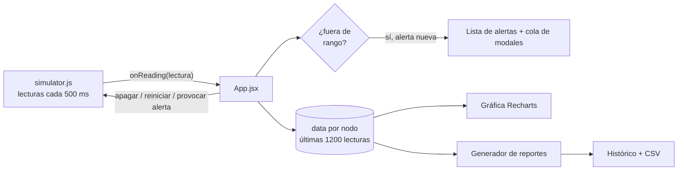
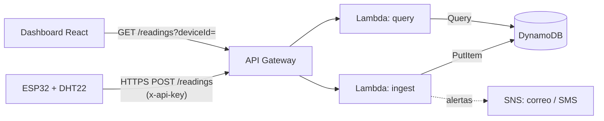

# Monitoreo IoT en tiempo real: dashboard con nodos ESP32 simulados

Dashboard web para supervisar sensores de temperatura y humedad en una operación agrícola: invernaderos, cuarto frío y secadero. Los nodos ESP32 son **simulados** en el navegador, pero el proyecto está diseñado para que, cuando se conecten dispositivos reales, **no haya que tocar la interfaz**.

**Demo en vivo:** _pega aquí el link de Vercel o Netlify_
**Autor:** Luis Morales, desarrollador Frontend / Full Stack

---

## Por qué existe este proyecto

La mayoría de proyectos IoT se quedan a medias: o tienen el hardware sin interfaz, o una interfaz sin datos reales. Este proyecto resuelve la parte de **producto**: cómo se ve, cómo se usa y cómo reacciona un sistema de monitoreo cuando algo sale mal. Y deja claro, con un diseño de arquitectura documentado, cómo se conectaría a hardware real y a la nube.

Qué demuestra:

- Diseño de interfaces para datos en tiempo real (actualización continua sin que la pantalla "salte").
- Manejo de estado complejo en React: múltiples dispositivos, historial, alertas, reportes.
- Criterio de arquitectura: un contrato de datos claro entre dispositivo y dashboard, y un camino realista hacia AWS.
- Atención a la experiencia de operación: qué ve una persona cuando un equipo falla y qué puede hacer al respecto.

## Qué se está simulando

Una finca con cuatro nodos, cada uno con un ESP32 y un sensor de temperatura y humedad (por ejemplo un DHT22):

| Nodo | Zona | Valores normales | Niveles aceptables |
|---|---|---|---|
| Invernadero A | Tomate | 26 °C / 68 % | 18–30 °C, 50–80 % |
| Invernadero B | Pimentón | 27 °C / 64 % | 18–31 °C, 50–80 % |
| Cuarto frío | Poscosecha | 8 °C / 85 % | 2–10 °C, 75–92 % |
| Secadero | Café | 31 °C / 45 % | 25–35 °C, 30–60 % |

El simulador (`src/simulator.js`) no genera números al azar sin más; imita el comportamiento de un sensor real:

- **Variación natural:** cada lectura cambia un poco respecto a la anterior (ruido), pero tiende a volver al valor normal del nodo, como un ambiente controlado.
- **Picos ocasionales:** de vez en cuando la temperatura sube y la humedad baja durante unos segundos, como pasaría si falla una ventilación.
- **Caídas de señal:** un nodo puede dejar de publicar unos 10 segundos, como cuando se pierde el WiFi.
- **Batería y señal:** cada lectura incluye nivel de batería (que baja lentamente) y RSSI (potencia de la señal WiFi).
- **Frecuencia:** 2 lecturas por segundo por nodo (cada 500 ms).

## Funcionalidades

- **Tiempo real fluido.** Las lecturas llegan cada 500 ms y la gráfica avanza sin animaciones que parpadeen.
- **Gráfica doble.** Temperatura y humedad en la misma gráfica, con ejes independientes y líneas punteadas en los límites de temperatura aceptables.
- **Historial navegable.** Se guardan 10 minutos por nodo. Un deslizador bajo la gráfica permite ver cómo estaba antes y un botón devuelve a la vista en vivo.
- **Estado por dispositivo.** Cada nodo se muestra con su estado actual:

  | Estado | Significado |
  |---|---|
  | En línea | Publica y está dentro de los niveles aceptables |
  | Fuera de rango | Publica, pero temperatura o humedad se salen de lo aceptable (tarjeta en rojo) |
  | Sin señal | No ha publicado en los últimos 3 segundos |
  | Apagado | Fue apagado desde el panel |
  | Reiniciando | Está en proceso de reinicio (6 s) |

- **Niveles aceptables editables** por nodo (temperatura y humedad, mínimo y máximo).
- **Alertas en modal.** Cuando una lectura sale de rango aparece un modal con el detalle. Si el nodo afectado no es el que se está viendo, su tarjeta se pone roja y el modal ofrece "Ver nodo". Cada alerta se registra en la lista de alertas recientes.
- **Apagar y reiniciar nodos.** Reiniciar además limpia cualquier anomalía en curso.
- **Agregar nodos** con nombre, zona, valores normales y niveles aceptables. El nuevo nodo empieza a publicar de inmediato.
- **Reportes e histórico.** Se genera un reporte del nodo seleccionado o de todos, con promedio, mínimo y máximo de temperatura y humedad, porcentaje del tiempo dentro de rango, número de alertas, estado y batería. Los reportes quedan en una tabla y se pueden **descargar como CSV**.
- **Modo claro y oscuro,** con el tema del sistema como valor inicial.
- **Responsive** (se adapta a celular) y con foco visible para navegación por teclado.

## Cómo funciona

### Estructura del proyecto

```
iot-dashboard/
├── index.html          Entrada de la app y carga de la tipografía
├── vite.config.js      Configuración de Vite con el plugin de React
├── package.json
└── src/
    ├── main.jsx        Monta la app de React
    ├── App.jsx         Interfaz y lógica de estado (dispositivos, alertas, reportes)
    ├── simulator.js    Simulador de nodos ESP32 y "comandos" hacia ellos
    └── index.css       Estilos con variables CSS para el tema claro y oscuro
```

### Flujo de datos



### Cada parte

**`simulator.js`.** Mantiene un registro de dispositivos y el estado interno de cada uno. Cada 500 ms recorre los nodos y, si no están apagados ni sin señal, calcula la nueva lectura y la entrega a quien se haya suscrito con `startSimulator(callback)`. Expone cuatro funciones que hacen de "comandos" hacia el dispositivo: `registerDevice` (alta de un nodo), `setPower` (apagar o encender), `restart` (reiniciar) e `injectSpike` (provocar una anomalía para la demostración).

**Recepción de lecturas (`App.jsx`).** Cada lectura se agrega al arreglo de su nodo, que conserva solo las últimas 1200 (10 minutos). Al mismo tiempo se evalúa contra los niveles aceptables de ese nodo.

**Alertas.** Hay cuatro tipos: temperatura alta o baja, humedad alta o baja. Una alerta se dispara solo cuando el tipo **aparece por primera vez**; mientras la condición continúe no se repite, y si el valor vuelve a rango y luego se sale otra vez, se genera una nueva. Así se evita inundar al usuario con un modal por cada lectura. Las alertas se guardan en un registro (hasta 200) y entran a una cola de modales (hasta 10).

**Estado de cada nodo.** Se calcula en cada render a partir de: si fue apagado, si está reiniciando, cuánto hace que llegó su última lectura y si esa lectura está dentro de rango. Detectar un nodo "sin señal" por **ausencia de datos** es exactamente cómo se haría con dispositivos reales.

**Gráfica e historial.** La gráfica muestra una ventana de 80 lecturas (40 segundos). Al mover el deslizador, la vista se "congela" con una copia de los datos de ese momento, así la gráfica no se mueve mientras se revisa el pasado. "Volver al vivo" descarta esa copia.

**Reportes.** Se calculan sobre las lecturas almacenadas de cada nodo: mínimo, máximo y promedio, porcentaje de lecturas dentro de rango, número de alertas registradas para ese nodo y estado actual. El CSV exportado incluye fecha, nodo, estado, segundos cubiertos, estadísticas, porcentaje en rango, alertas y batería.

**Estilos.** Los colores son variables CSS definidas para el tema claro y el oscuro, y las gráficas toman sus colores del tema activo.

### Contrato de datos

Todo el dashboard depende de esta forma de lectura, la misma que enviaría el firmware real:

```json
{
  "deviceId": "esp32-inv-01",
  "ts": 1767225600000,
  "temperature": 26.4,
  "humidity": 67.9,
  "battery": 91.2,
  "rssi": -63
}
```

## Cómo lo llevaría a producción



1. **Firmware.** El ESP32 lee el sensor y envía el JSON del contrato por HTTPS. Ejemplo mínimo en Arduino:

   ```cpp
   #include <WiFi.h>
   #include <HTTPClient.h>
   #include <DHT.h>

   DHT dht(4, DHT22);

   void loop() {
     float t = dht.readTemperature(), h = dht.readHumidity();
     if (!isnan(t) && !isnan(h)) {
       HTTPClient http;
       http.begin(API_URL);
       http.addHeader("Content-Type", "application/json");
       http.addHeader("x-api-key", API_KEY);
       String body = "{\"deviceId\":\"esp32-inv-01\",\"temperature\":" + String(t, 1) +
                     ",\"humidity\":" + String(h, 1) + ",\"rssi\":" + WiFi.RSSI() + "}";
       http.POST(body);
       http.end();
     }
     delay(2000);
   }
   ```

2. **API Gateway.** Expone `POST /readings` y `GET /readings`, con API key y límites de uso por dispositivo.
3. **Lambda `ingest`.** Valida el payload y **asigna `ts` en el servidor** (un ESP32 no tiene un reloj confiable), y escribe en DynamoDB. Si hay umbral superado, publica en SNS.
4. **DynamoDB.** Clave de partición `deviceId`, clave de ordenamiento `ts`, y un atributo TTL para borrar lecturas antiguas y controlar costos.
5. **Lambda `query`.** Devuelve las últimas N lecturas de un dispositivo, o las posteriores a un `ts`.
6. **Dashboard.** Se reemplaza `startSimulator` por un `fetch` con polling cada 1 a 2 segundos. El resto de la aplicación no cambia, porque ya solo conoce el contrato de datos.
7. **Comandos (apagar y reiniciar).** El dashboard publicaría un comando que el firmware consulta o recibe. Con AWS IoT Core serían mensajes MQTT a un topic del dispositivo o un cambio en su *device shadow*.

**Para una versión productiva:** AWS IoT Core con MQTT y certificados por dispositivo en lugar de API key, WebSockets para empujar datos sin polling, autenticación de usuarios (Cognito) y persistencia de los niveles aceptables y los reportes en base de datos.

## Ejecutar en local

Requisitos: Node.js 18 o superior.

```bash
npm install
npm run dev       # servidor de desarrollo
npm run build     # genera la carpeta dist
npm run preview   # sirve el build localmente
```

## Despliegue gratuito

**Vercel o Netlify (recomendado).**
1. Sube el proyecto a un repositorio de GitHub.
2. Importa el repositorio en Vercel o Netlify.
3. Framework: Vite. Comando de build: `npm run build`. Carpeta de salida: `dist`.
4. Cada `git push` vuelve a desplegar automáticamente.

**GitHub Pages.** Agrega `base: '/nombre-del-repo/'` en `vite.config.js`, ejecuta `npm run build` y publica la carpeta `dist`.

## Decisiones técnicas

- **React + Vite:** arranque y recarga rápidos, y un build estático que se despliega gratis en cualquier lado.
- **Recharts:** gráficas declarativas y suficientes para series de tiempo. Se desactivaron sus animaciones para que el flujo continuo se vea fluido.
- **CSS propio con variables:** el tema oscuro y claro se resuelven en un solo lugar y no hay configuración extra.
- **Simulador desacoplado:** la interfaz solo recibe lecturas con el formato del contrato, sin saber de dónde vienen. Ese es el punto de unión con el backend real.
- **Sin backend ni base de datos:** a propósito, para que cualquiera pueda abrir la demo sin infraestructura.

## Limitaciones y próximos pasos

- Los datos, niveles y reportes viven en memoria: al recargar la página se reinician.
- El simulador corre en el navegador de cada visitante; no hay datos compartidos entre personas.
- Pendiente: conectar un ESP32 real al diseño descrito, autenticación de usuarios, pruebas automatizadas del cálculo de alertas y reportes, y notificaciones fuera de la app (correo o WhatsApp).

## Stack

React 18 · Vite 5 · Recharts 2 · CSS con variables · JavaScript (ES modules)

---

Hecho por **Luis Morales** · nandoarmo01@gmail.com · Cali, Colombia
